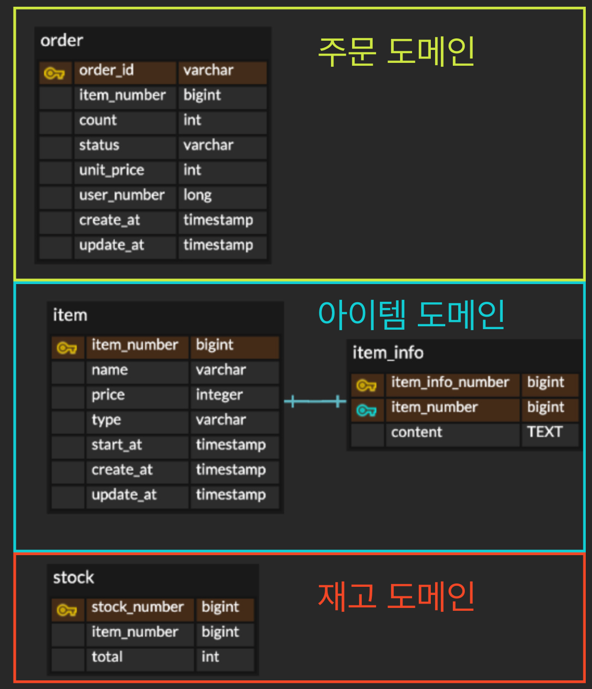
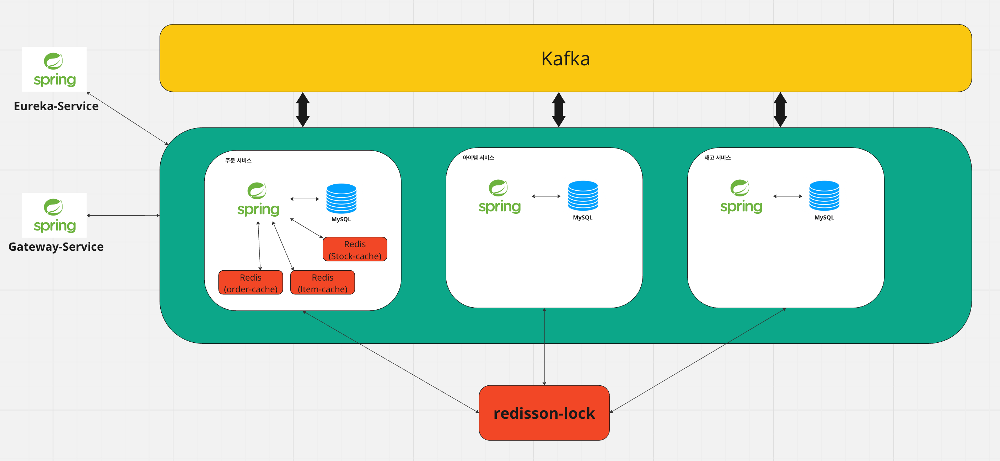
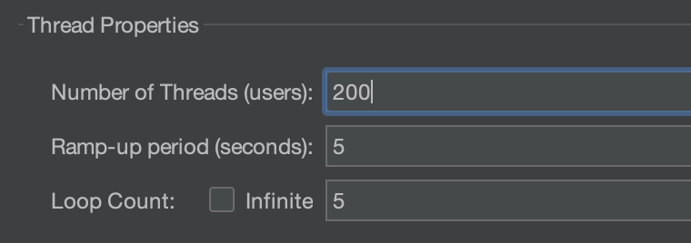
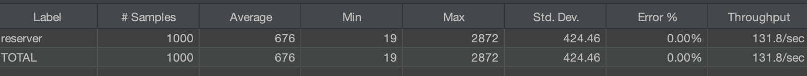
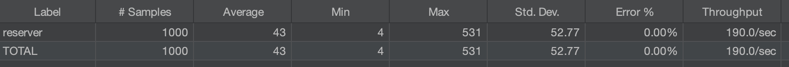

# 📘 개요
- 선착순(한정된 재고 및 특정시간 오픈) 및 일반 아이템을 구매 서비스를 제공하는 백엔드 서버입니다.
- MSA 아키텍쳐로 구성되어 있으며, Docker 환경에서 테스트할 수 있습니다.
<br/><br/>
# 📕 기술 스택
- Java 17, Spring Boot 3.1.8
- Spring Cloud(Eureka, Gateway, Feign Client), JPA
- MySQL, Kafka, H2, Redis, Redisson
- JUnit5, Mockito, JMeter
- Docker, Docker Compose
<br/><br/>
# 📙 Module 구조
#### `common-kafka` : 카프카 공통 기능 추상화 및 설정 모듈
#### `common-redis` : 레디스 공통 기능 추상화 및 설정 모듈
#### `common-service-data` : 카프카 공통 기능 추상화 및 설정 모듈
#### `eureka-service` : 동적으로 각 서비스를 등록하고, 식별하기 위한 서비스
#### `gateway-service` : API Gateway 역할(라우팅, 로드밸런싱, 필터링 등)
#### `item-service-api` : 아이템 도메인 관련 서버 (아이템 정보 제공 등)
#### `order-service-api` : 주문 도메인 관련 서버 (주문 진입, 주문 완료 등)
#### `stock-service-api` : 재고 도메인 관련 서버 (아이템 재고 관리 및 조회 등)
<br/>

# 📘 E-R 다이어그램
<p align='center'>
    
</p>

# 📕 Architecture
<p align='center'>
    
</p>

# 📙 Trouble Shooting
<details>
<summary>레디스 활용 (1.캐싱 | 2.분산 락 |3. 루아 스크립트 적용)</summary>

- <h2>#1 레디스 캐싱을 통한 성능 개선</h2>

    - **문제**  | 주문 진입 처리 시 낮은 TPS 처리로 인한 대규모 트래픽 감당 불가
    - **원인**  | MSA 특성상 도메인 별로 분리되어 있어, 정보 요청을 위해 서비스 간 REST 요청이 필요하고, 동기식 + Blocking으로 인한 
    - **대안** | <br/>
        1. 레디스를 통한 캐시 적용 **(✅선택)**
        2. 한정된 스레드 풀 및 커넥션 풀 개선을 위한 WebFlux 적용
    - **선택 이유**<br/>        
        1. 레디스에 캐시된 데이터는 DB접근 없이 빠르게 데이터를 갖고 올 수 있음
        2. WebFlux는 학습곡선이 높고, DB 접근과 같이 Blocking 요청을 제거해야함<br/>
            -> WebClient, R2DBC,  MySQL jasync Driver를 적용하면 되지만, 이는 공식적으로 지원되는 것이 아닌 오픈 소스이라 실제 환경에 적용하기는 부담스러움
    - **결과** | <br/>
        1. Look Aside 패턴 활용(-> 캐시에 없으면 정보 요청 후, 캐시에 반영하는 방식)<br/>        
        2. 성능 약 1.5배 향상 (테스트 환경 : 초당 200개의 요청 | TPS : 130 (Before) -> 191 (After) )<br/>

        **테스트 환경 (Before & After)**
        <p align='center'> 
            
            <h4>
                - 테스트 결과
            </h4>
            <p align='center'>
            
            ⬇️
            
            <p/>
            
        </p>


- <h2>#2 Redisson을 활용한 분산락 적용</h2>

    - **문제** | 
        1. 동시에 많은 구매 요청 시, DB서버 부하로 인한 서비스 장애
        2. 대규모 트래픽에서 레디스 캐시 미스 시 순간적인 부하 발생
    - **원인** | 
        1. 데이터베이스 업데이트 요청시, DB 락 경합으로 DB 서버 부하가 장애로 연결됨
        2. 레디스 캐시 미스 시, 모든 요청이 다른 서비스에 REST요청 -> DB를 조회 -> 캐시 Rewrite 순으로 중복 처리되어 DB 부하 및 리소스 낭비 발생
    - **대안** |
        1. Redisson을 통한 분산락 적용
    - **선택 이유**
        1. Redisson의 분산락을 활용하면, 분리된 서비스들의 락 관리가 용이
        2. Redisson의 분산락은 pub/sub 구조로 스핀락에 비해 효율적임
    - **결과** |
        1. 동시에 DB에 락 부하를 주지 않아, DB 성능 향상 및 장애 발생 가능성 제거
        2. 캐시 미스 시, 가장 먼저 락을 휙득한 요청이 캐시를 갱신하여, 리소스 낭비 및 부하 감소

<br/>       
        
- <h2>#3 원자성 보장을 위한 루아 스크립트 사용</h2>

    - **문제** |
        1. 유저가 2개 이상 구매시, 레디스 재고 관리 문제 발생 
    - **원인** |
        1. 레디스의 increment를 통해 1개의 구매는 원자적으로 처리가 가능하지만, 2개이상 구매시 이 후 구매는 재고가 부족하여 문제가 발생함
    - **대안** |
        1. 레디스의 트랜잭션 적용
        2. 루아 스크립트 적용 **(✅선택)**
    - **선택 이유** |
        1. 레디스의 트랜잭션은 rollback 기능이 없고, 부분 성공에 대한 처리가 어려움
        2. 레디스의 루아 스크립트는 원자적으로 처리되므로, 여러개의 재고 차감을 한번에 처리할 수 있음
    - **결과** |
        1. 유저의 2개 이상 구매시, 재고 동시성 문제를 해결할 수 있게 되었음.
        2. 루아 스크립트를 통해, 재사용성이 향상 되었음.
        3. 루아 스크립트는 여러 명령어를 하나의 스크립트로 묶어서 전송해 성능 향상이 될 수 있음 (-> 네트워크 전송 비용 감소)


</details>

<br/>
<details>
<summary>카프카 도입을 통한 성능 향상</summary>

- <h2>#1 메세징 큐를 도입하여 비동기 처리</h2>

    - **문제** |
        1. 유저가 주문 요청 시, 결제 처리 및 주문 반영 등 추가 처리로 인한 TPS 감소
    - **원인** |
        1. 결제 처리 및 데이터베이스 반영등 다른 서비스에 I/O 요청으로 인한 Blocking 로직으로 성능 저하가 발생함
    - **대안** |
        1. 메세징 큐를 활용한 비동기 처리
    - **선택 이유** |
        1. 결제 가능 여부(ex: 잔액 조회)등 처리 가능 여부 정도만 실시간으로 조회하고, 실제 데이터베이스 업데이트 및 다른 서비스의 요청 등은 비동기로 전환하면 성능 향상에 도움이 될 수 있음
    - **결과** |
        1. 메세징 큐를 적용하여 결과적으로 비동기적으로 업데이트 요청을 다를 수 있게 되었음.
        2. 실시간으로 서비스간 요청하여 처리하는 것보다 성능이 향상되어 더 많은 TPS를 처리할 수 있게 되었음


</details>
<br/>
<details>
<summary>가상 스레드 적용 & 테스트 결과 (+ 성능향상을 위해 가상스레드를 사용했지만 롤백한 이유)</summary>

- <h2>#1 가상 스레드 적용 및 성능 향상 예상</h2>

    - **문제** |
        1. 가상 스레드 적용 후, 제한 없는 스레드 개수로 인한 성능 향상 예상
    - **원인** |
        1. 유저의 많은 요청이 들어와도 DB의 한정된 커넥션 개수 제한으로 인한 성능 향상이 없음
        2. MySQL 커넥터는 내부적로 synchronized로 블락되어, 가상 스레드를 적용하더라도 성능 향상이 되지 않음
    - **대안** |
        1. R2DBC를 적용하고, MySQL 커넥터 오픈 소스인 jasync를 적용
    - **적용 안한 이유**
        1. jasync 커넥터는 오픈소스이며, MySQL에서 제공하는 커넥터가 아님
        2. 오픈소스이며, 신뢰성이 낮음
        
</details>
<br/>

# 📘 API
- API 요청 시, Prefix로 /api 요청해야 합니다.
- Http 프로토콜, 8000 포트로 요청하면 테스트해볼 수 있습니다.
- 로그인이 필요한 요청은 Authorization 헤더에 Long 범위의 정수를 삽입하여 요청해야 합니다. (로그인은 중점 사항이 아님.)

    <details>
    <summary>아이템 도메인 API</summary>

    - **아이템 단건 조회**
        **Path** : /item/{itemNumber}    
        **Response Example**
        ``` JSON
        {
            "success" : true,
            "data" : {
                "itemNumber" : 1,
                "name" : "라면",
                "content" : "라면입니다.",
                "price" : 1000,
                "type" : "{TIME_DEAL | GENERAL}", // {선착순 | 일반}
                "start_at" : "YYYY-MM-DD hh:mm:ss" //[optional] type = 선착순인 경우
            }
        }
        ```
    - 아이템 다중 조회 <br/>
        **Path** : /item<br/> 
        **Response Example**
        ```JSON
        {
            "success" : true,
            "data" : [
                {
                    "itemNumber" : 1,
                    "name" : "라면",
                    "price" : 1000,
                    "type" : "{TIME_DEAL | GENERAL}",
                    "startAt" : "YYYY-MM-DD hh:mm:ss" //[optional] type = TIME_DEAL인 경우
                },
                // ...
            ]
        }
        ```
    - 아이템 <-> 주문 서비스 캐시용 (외부 노출x)<br/>
        **Path** : /item/{itemNumber}/cache<br/>
        **Response Example**
        ```JSON
        {
            "itemNumber" : 1,
            "price" : 1000,
            "type" : "{TIME_DEAL | GENERAL}",
            "startAt" : "YYYY-MM-DD hh:mm:ss" //[optional] type = TIME_DEAL인 경우
        }
        ```

    </details>

    <details>
    <summary>재고 도메인 API</summary>

    - 재고 조회<br/>
        **Path** : /stock/{itemNumber}<br/>
        **Response Example**
        ```JSON
        {
            "success" : true,
            "data" : 100 // 아이템 재고
        }
        ```
    - 재고 <-> 주문 서비스 캐시용 (외부 노출x)<br/>
        **Path** : /stock/{itemNumber}/cache <br/>
        **Response Example**
        ```JSON
        {
            "success" : true,
            "data" : 100 // 아이템 재고
        }
        ```
    </details>

    <details>
    <summary>주문 도메인 API</summary>

    - **주문 진입 [로그인 필요]**<br/>
        **Path** : /order<br/>
        **Request Example** <br/>
        ```JSON
        {
            "itemNumber" : 1,
            "count" : 1
        }
        ```
        **Response Example**
        ```JSON
        {
            "success" : true,
            "data" : "orderId"
        }
        ```
    - **주문 결제 처리 [로그인 필요]**<br/>
        **Path** : /order/{orderId} <br/>        
        **Response Example**
        ```JSON
        {
            "success" : true,
            "data" : 100 // 아이템 재고
        }
        ```
    </details>

# 📕 How to run?
```
1. gradle build --exclude-task test
2. docker-compose up -d
```
